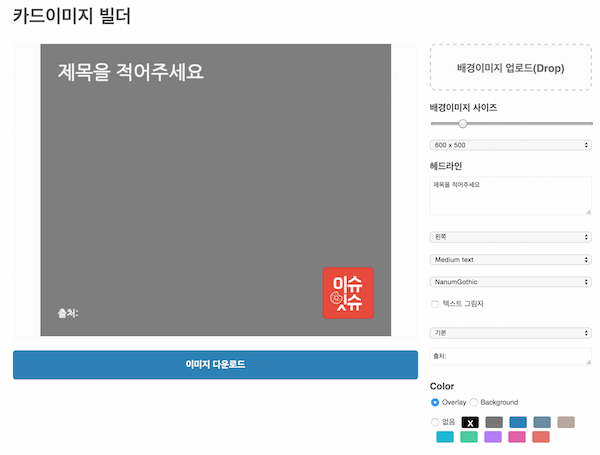

# 카드이미지 빌더 

[vox의 meme](https://github.com/voxmedia/meme) 카피 

## 개발하기 

### install 

* `git clone git@github.com:niceaji/image-builder.git`
* `bundle install`
* `bundle exec middleman`

로컬 웹서버 시작 `http://localhost:4567/`

### static file build 

* `bundle exec middleman build`

## 데모구경 

* http://niceaji.github.com/image-builder

